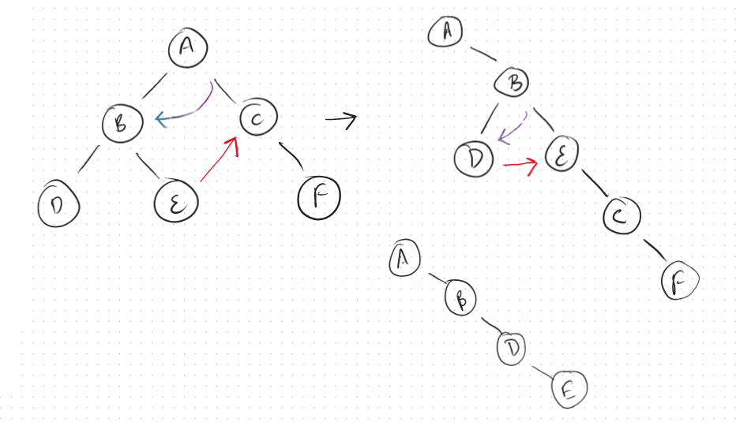

```python
def flatten(self, root):
		curr = root
		while curr:
			if curr.left is None:
				curr = curr.right
			else:
				pre = curr.left
				while pre.right:
					pre = pre.right
				# Link pre to curr right
				pre.right = curr.right
				# Swap child nodes
				curr.right = curr.left
				curr.left = None
				# Go right
				curr = curr.right
```
